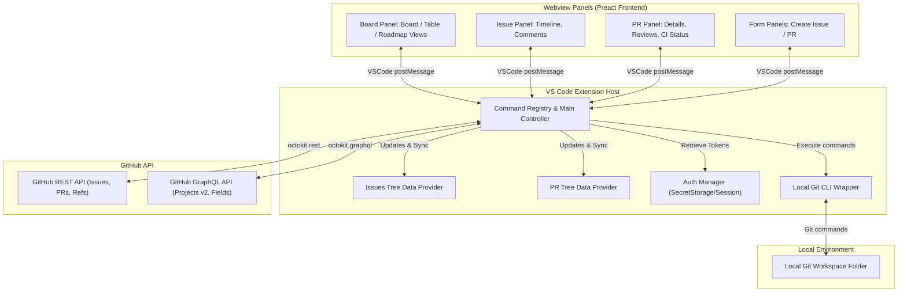
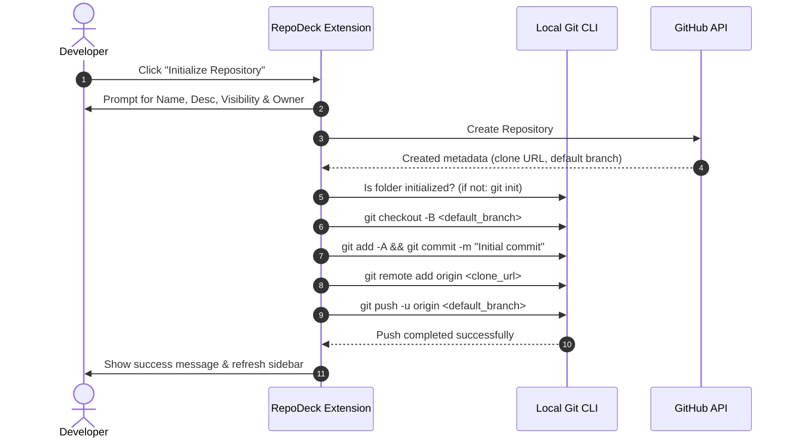
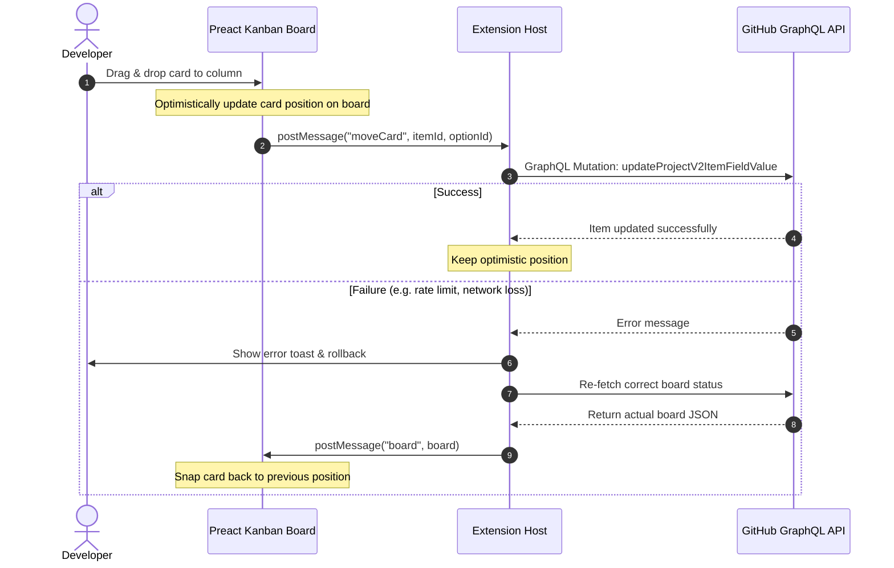
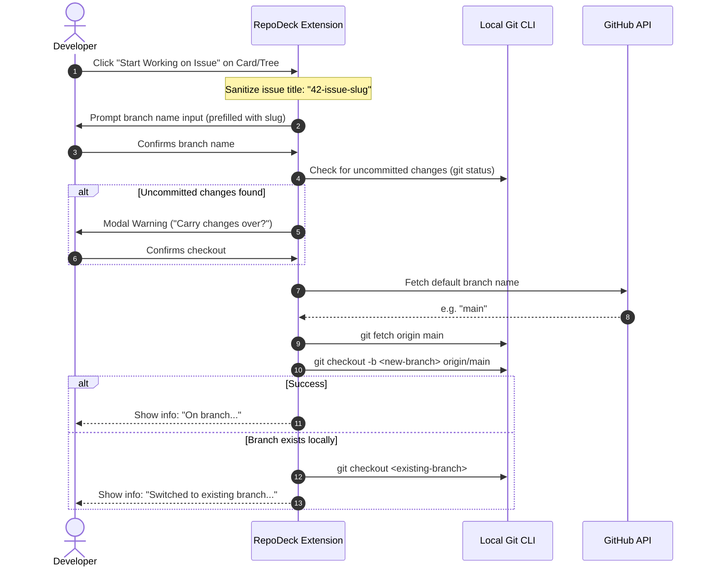

#  RepoDeck

> Initialize repositories, create/assign issues, and manage GitHub Project boards with a real interactive Kanban — without leaving your editor.

[](https://marketplace.visualstudio.com/items?itemName=martian7777.repodeck)
[](https://open-vsx.org/extension/martian7777/repodeck)
[](LICENSE)

**RepoDeck** is a lightweight, high-performance GitHub client built directly into VS Code. It is designed to run anywhere, especially on independent editor forks (such as **Google Antigravity**, **Cursor**, **Windsurf**, and **VSCodium**) where the official GitHub extension has limited functionality, licensing restrictions, or authentication hurdles.

---

## 🔍 The Problem & The Solution

### ❌ The Problem with the Official GitHub Extension
1. **No Project Board Support**: The official extension lists issues and PRs, but completely lacks interactive project board (Kanban) support. Tracking project boards forces you to jump out of your editor into a browser tab.
2. **Proprietary & Restricted Authentication**: The official extension relies heavily on VS Code’s built-in Microsoft/GitHub authentication providers. On alternative forks (Cursor, Windsurf, VSCodium, Antigravity), this provider is often broken, locked down, or requires complex workspace logins.
3. **No Setup/Initialization Workflow**: The official extension assumes your git repository is already created, configured, and pushed to GitHub. There is no helper to take a blank local workspace directory to a live GitHub repository.
4. **Heavyweight & Capped Search API**: Large projects frequently experience rate-limiting issues because the official extension queries search endpoints that are restricted to 30 requests per minute.

### ✔️ The RepoDeck Solution
1. **Interactive Kanban, Editable Tables, & Roadmaps**: An integrated Preact-powered Project Board panel supporting drag-and-drop status changes, spreadsheet-like table edits, and Gantt-style roadmap schedules.
2. **PAT Authentication Storage**: Authenticates using the standard session manager *or* a Personal Access Token (PAT). Token storage is encrypted locally via VS Code's `SecretStorage` API, working seamlessly on all VS Code forks.
3. **Complete Local-to-Remote Initializer**: Create a repository on GitHub (under a personal or organizational account), initialize local git, set remote `origin`, create the initial commit, and push it up — all from a single click.
4. **Background Caching & List APIs**: Instantly paint UI elements from a persistent cache upon window reload, and update states in the background. Uses optimized listing endpoints (capped at a generous 5,000/hour budget) rather than search endpoints.

---

## 🛠️ Architecture & System Design

RepoDeck divides its responsibilities between a backend running in the **VS Code Extension Host** (handling authentication, local Git CLI operations, and GitHub API communication) and a frontend running inside **VS Code Webviews** (powered by Preact).



---

## ✨ Features

### 📦 1. Repository Initializer
Take a blank workspace folder from absolute zero to a fully wired GitHub repository:
- Runs `git init` locally.
- Authenticates and prompts for owner (Personal Account or Member Organization), repository name, description, and visibility (Public/Private).
- Creates the repository on GitHub.
- Configures local `origin` tracking.
- Performs an initial commit (empty-tree supported) and pushes it to the remote default branch.



---

### 📋 2. Project Boards (Kanban, Tables & Roadmaps)
Manage GitHub Projects (v2) with fluid, interactive layouts that switch instantly without refetching:
- **Board Layout**: A drag-and-drop Kanban view. Column headers are sticky, and columns have independent scrollbars. Cards feature visual status indicators, title, number, and assignees.
- **Table Layout**: A powerful, keyboard-friendly spreadsheet interface to edit all project fields (single-select status, iterations, dates, numbers, text, assignees, and titles) inline.
- **Roadmap Layout**: A visual timeline arranging cards across a time axis using start-date and target-date custom fields.
- **Custom Project Creation**: Create new Projects directly from the editor, link them to the repo, define custom columns, and add custom fields.
- **Optimistic Drag-and-Drop**: Moves cards instantly on the UI, and issues a GraphQL mutation behind the scenes. If the mutation fails, RepoDeck rolls back the card automatically to maintain data consistency.



---

### 🌿 3. "Start Working on Issue" Workflow
Automates branching directly from an issue:
- Creates and checks out a new branch locally.
- Guarantees branch creation branches from the repository's default branch (e.g. `main` or `master`) rather than whatever branch you happen to have open, preventing dirty parent-branch commits.
- Sanitizes issue titles automatically into standard branch names (e.g., `42-add-markdown-support`).



---

### 💬 4. Issues & Pull Requests Detail Panels
Interact with issues and PRs in rich, responsive webviews:
- **Markdown Rendering**: Issue summaries, descriptions, PR descriptions, and timeline comments render full markdown (headings, links, lists, code highlighting, tables) instead of raw text.
- **Threaded Timeline**: Pull Request and Issue detail panels show full history, comment threads, reviews, events, and automated test check statuses (CI).
- **Draft Support**: Mark draft pull requests as "Ready for Review" directly from the editor panel.
- **One-click checkout**: Click to pull and check out any pull request branch locally.
- **Direct Merges**: Merge pull requests using **Merge Commit**, **Squash and Merge**, or **Rebase and Merge** methods directly, with full confirmation prompts and an option to prune/delete the remote branch immediately after.

---

## 🔑 Authentication Setup

RepoDeck asks the host editor for a GitHub account session first. If the editor does not provide one, RepoDeck prompts you to supply a **Personal Access Token (PAT)**.

To create a PAT, go to **GitHub Settings > Developer Settings > Personal Access Tokens (Classic)**. 

### Required Token Scopes
When generating the token, ensure you check the following permissions:
- `repo` — Read/Write repository code, commit history, pull requests, issues, and git refs.
- `read:org` — List organization memberships to fetch projects and create organization repositories.
- `project` — Read/Write GitHub Projects (v2). **Without this scope, Projects will be completely inaccessible via GitHub's GraphQL API, returning empty boards.**

---

## 🛠️ Developer Guide & Contributions

### Prerequisites
- [Node.js](https://nodejs.org/) (v18+)
- [Git](https://git-scm.com/)

### Setup & Run locally
1. Clone this repository:
   ```bash
   git clone https://github.com/martian7777/repodeck.git
   cd repodeck
   ```
2. Install dependencies:
   ```bash
   npm install
   ```
3. Run the development watcher:
   ```bash
   npm run watch
   ```
4. In VS Code, press `F5` (or click `Run and Debug` > `Run Extension`) to launch an Extension Development Host window with RepoDeck loaded.

### Available Scripts
- `npm run build` — Compile extension sources and webview modules.
- `npm run watch` — Compile and watch files for hot-reloading changes.
- `npm run typecheck` — Perform static TypeScript type verification.
- `npm run package` — Compile production bundles and compile the final `.vsix` installer.

---

*Disclaimer: RepoDeck is an independent open-source project and is not affiliated with, authorized, or endorsed by GitHub, Inc.*
